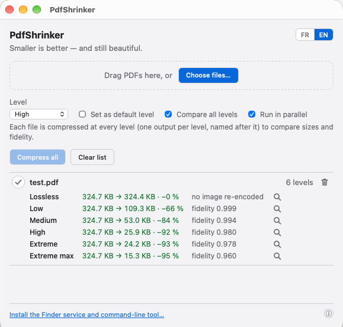
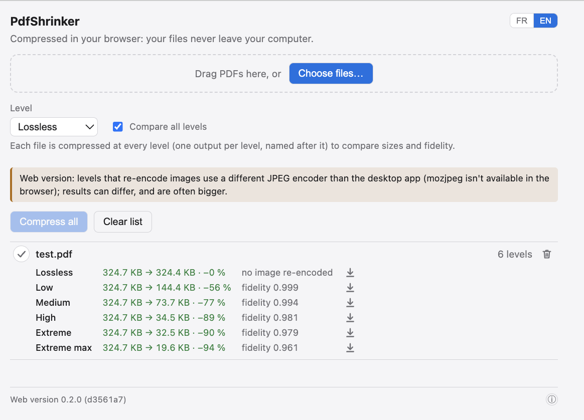

# PdfShrinker

[](https://github.com/hpwxf/pdf-shrinker/actions/workflows/ci.yml)

Compresses PDFs on macOS — like iLovePDF or UPDF — shrinking file size while staying in PDF format
(no zip). Written in Rust, Apple Silicon only.

Four ways to use it:

- **From the command line** (`pdfshrink`)
- **A macOS app** (`PdfShrinker.app`, installable via `.dmg`), which shows up in Finder › right-click
  a PDF › **Open With**
- **A Finder service** (right-click a PDF › **Services** › PdfShrinker), which compresses
  immediately at whatever default level is set in the app
- **A web page** (`web/`, online at **<https://hpwxf.github.io/pdf-shrinker/>**), where the same engine, compiled to WebAssembly,
  runs entirely in the browser: the server only serves static files and the PDFs never leave the
  computer

The same `test.pdf` at every level, in each front end:

<table>
  <tr>
    <th>macOS app</th>
    <th>Web version</th>
  </tr>
  <tr>
    <td></td>
    <td></td>
  </tr>
  <tr>
    <th colspan="2">Command line</th>
  </tr>
  <tr>
    <td colspan="2">
<pre>$ for l in lossless low medium high extreme extreme-max; do
    pdfshrink -l $l --tune fidelity=1 --suffix $l test.pdf
  done
test.pdf  ->  ./test-lossless.pdf   324.7 KB -> 324.4 KB  (-0%)
test.pdf  ->  ./test-low.pdf   324.7 KB -> 109.3 KB  (-66%)  image fidelity 0.999 (min 0.999, 1 images)
test.pdf  ->  ./test-medium.pdf   324.7 KB -> 53.0 KB  (-84%)  image fidelity 0.994 (min 0.994, 1 images)
test.pdf  ->  ./test-high.pdf   324.7 KB -> 25.9 KB  (-92%)  image fidelity 0.980 (min 0.980, 1 images)
test.pdf  ->  ./test-extreme.pdf   324.7 KB -> 24.2 KB  (-93%)  image fidelity 0.978 (min 0.978, 1 images)
test.pdf  ->  ./test-extreme-max.pdf   324.7 KB -> 15.3 KB  (-95%)  image fidelity 0.960 (min 0.960, 1 images)</pre>
    </td>
  </tr>
</table>

The CLI and the app share the engine and give the same files; the web version re-encodes JPEGs
without mozjpeg, hence its bigger results (see [Web version](#web-version)).

Six compression levels: **Lossless** (structural cleanup only), **Low**, **Medium** (default),
**High**, **Extreme**, **Extreme-max**. The compressed file is written next to the original (`name-compressed.pdf`); the original is
never touched, and if the result isn't actually smaller, nothing is written.

## Installation

Download the `.dmg` (see [Build](#build) to produce it yourself), open it, drag `PdfShrinker.app` into
`Applications`. The app isn't signed with an Apple Developer account (ad-hoc signature only), so
Gatekeeper will warn on first launch — right-click the app › **Open**.

On first launch, the **"Install the Finder service and command-line tool"** button in the app:

- installs the Finder service (`~/Library/Services`);
- creates a `pdfshrink` symlink pointing at the CLI bundled inside the app, in `/usr/local/bin`
  if that directory is writable (it is `root:wheel` on a stock macOS) and otherwise in `~/.local/bin`.

(Command-line equivalent: `pdfshrink install --finder-service --cli-link`.)

## Usage

### Command line

```bash
pdfshrink file.pdf                          # default level (configurable)
pdfshrink -l high file.pdf                   # explicit level
pdfshrink -l medium *.pdf                    # multiple files, in parallel
pdfshrink config get level                   # read a persisted default
pdfshrink config set level low               # change a persisted default
```

Levels (`-l`), each building on the previous: `lossless`, `low`, `medium` (default), `high`,
`extreme`, `extreme-max`. `pdfshrink --help` sums each one up in a line; details in
[`docs/compression-strategies.md`](docs/compression-strategies.md).

Everything is done by a built-in Rust engine: no external tool (Ghostscript or otherwise) is needed.

Exit codes: `0` success, `1` error, `2` at least one file was already optimal (nothing written for
it).

### App

Drag PDFs into the window (or right-click a PDF › **Open With** › PdfShrinker), pick a level, hit
**Compress**. The **"Set as default level"** checkbox also changes what the Finder service does,
since both read the same setting.

### Web version

Open <https://hpwxf.github.io/pdf-shrinker/>. Same list, levels and "Compare all levels" as the app; each result is downloaded instead of
written next to the original. It can't use mozjpeg (a C library) in the browser and re-encodes
JPEGs with a pure-Rust encoder instead, so files from levels that re-encode images are usually
bigger than the app's — the page says so above the level. Images are processed one after another,
on a single thread.

### Finder service

Right-click one or more PDFs in Finder › **Services** › **PdfShrinker**. Compresses immediately at
the app's default level, then shows a macOS notification.

It is *not* in the **Quick Actions** submenu, and it does not appear in System Settings › General ›
Login Items & Extensions › Finder. That submenu and that list are fed only by Action extensions
(`.appex`) and Shortcuts; as of macOS 26 an Automator `.workflow` — which is what this is — can only
ever land under **Services**.

## Build

Requirements: Rust (`rustup target add aarch64-apple-darwin`), Xcode Command Line Tools, `cargo-tauri`
(`cargo install tauri-cli --version "^2"`). No runtime dependency.

```bash
# CLI only
cargo build --release -p pdfshrink-cli

# App + .dmg (full installer, ad-hoc signed)
./scripts/build-dmg.sh

# Web version into web/dist (needs `rustup target add wasm32-unknown-unknown` and a
# wasm-bindgen-cli matching Cargo.lock), then serve it over http (not file://)
./scripts/build-web.sh
python3 -m http.server -d web/dist 8000
```

The web version is published to GitHub Pages, at <https://hpwxf.github.io/pdf-shrinker/>.

<!-- Maintainers: deployed on demand — Actions › "Web version (GitHub Pages)" › Run workflow, from
master (.github/workflows/pages.yml). One-time setup: Settings › Pages › Source: "GitHub Actions". -->

See [`CLAUDE.md`](CLAUDE.md) for the detailed architecture (compression engine, effective-DPI
calculation for images, Tauri app structure, etc.), development commands (`cargo test`,
`cargo tauri dev`, generating a test PDF…) and the current state of verification.

## License

MIT.
